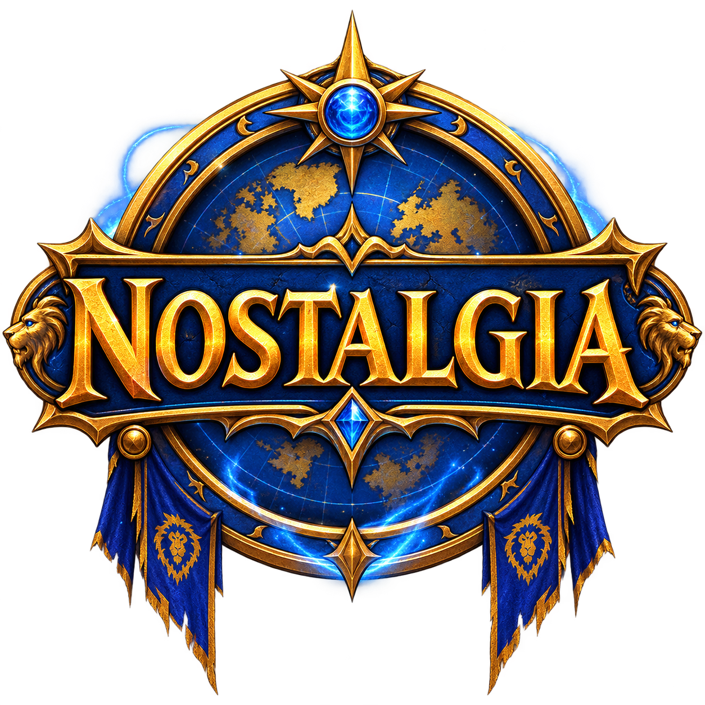
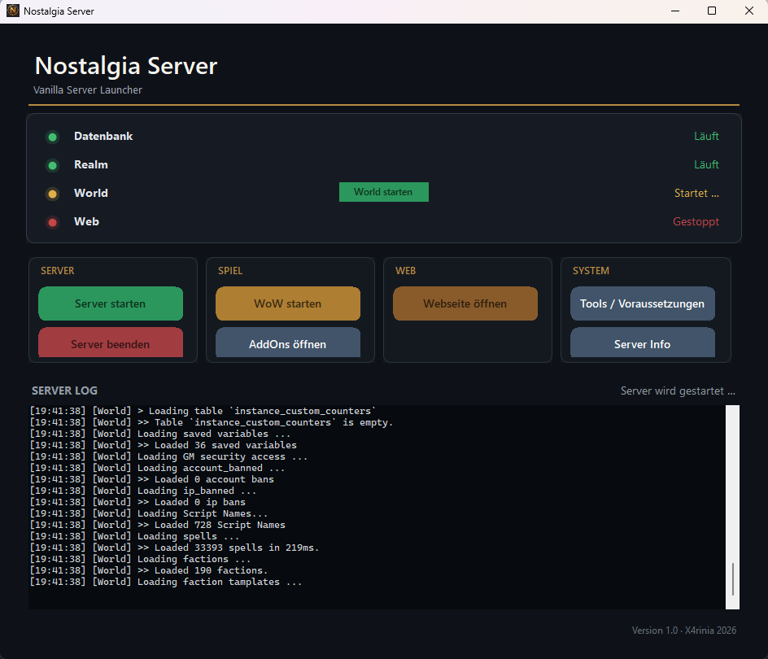

# Nostalgia Repack

<p align="center">
  
</p>

Nostalgia is a small-group Vanilla server project based on [vMaNGOS Core](https://github.com/vmangos/core). It keeps Naxxramas as endgame content, adds player-accessible PartyBots and a nostalgic fake `/1` chat, and includes a lightweight local account and character-management page.

**Language:** Nostalgia is primarily a German-language project. Its ambient/fake chat, in-game messages, website and repack guidance are therefore mainly German, with familiar Vanilla abbreviations such as `lfm`, `wts` and `boe` intentionally retained.

This repository is a **build package**, not a World of Warcraft distribution. It intentionally contains no game client, MPQ files, DBC/maps, extracted game data, database dumps, player data, logs, compiled executables, Apache/PHP runtime or MariaDB runtime.

## Included

- `patches/nostalgia-core.patch` – Nostalgia changes for vMaNGOS Core
- `database/custom/` – SQL files for world, character and login databases
- `addons/xbot/` – optional XBot addon source
- `addons/DinoController/` and `controller/` – minimal Vanilla controller addon and XInput bridge
- `web/www/` – local PHP management page and Nostalgia artwork
- `repack-scripts/` – Start, Stop and web server scripts as templates
- `launcher/` – C# Windows Launcher to easily start and manage the server processes

## Core build

The patch was created against vMaNGOS `development` commit `467fc53f6d8e48a0380b8a2734e66cc7f71e9dd8`.

```text
git clone https://github.com/vmangos/core.git source
cd source
git checkout 467fc53f6d8e48a0380b8a2734e66cc7f71e9dd8
git apply --check ../Nostalgia-Repack/patches/nostalgia-core.patch
git apply ../Nostalgia-Repack/patches/nostalgia-core.patch
```

Build the patched core using the current vMaNGOS build instructions for your operating system. The generated `mangosd.conf.dist` documents the Nostalgia-specific configuration values.

## Database import order

Use a backup before importing SQL into an existing realm.

| Database | Files |
| --- | --- |
| World | `nostalgia_ambient_chat.sql`, `nostalgia_ambient_chat_who_factions.sql`, `nostalgia_content_locks.sql`, `nostalgia_instance_sizes.sql`, `nostalgia_transmog_world.sql`, `nostalgia_ascii_german_locales.sql`, `nostalgia_gurubashi_hourly.sql` |
| Characters | `nostalgia_ahbot_owner_characters.sql`, `nostalgia_transmog_characters.sql` |
| Login | `nostalgia_realmname.sql` |

Import `nostalgia_ambient_chat.sql` before `nostalgia_ambient_chat_who_factions.sql`. The second file is safe to run repeatedly and only refreshes its own Horde fake-player entries.

## Features

- Naxxramas endcontent; Zul'Gurub and both Ahn'Qiraj raids are locked at their entrances
- Global `/1` chat with fake players, faction-aware `/who`, whisper replies and fake-player PartyBot invites
- Optional outdoor rival encounters: an opposing BattleBot challenges eligible players outside safe areas and awards normal PvP honor; enemy territory can use a higher chance and GMs can inspect it with `.rival debug` / `.rival status`
- Two to four permanent free-for-all BattleBot rivals roam Gurubashi Arena, attack players entering the ring and rotate hourly; the chest itself runs on each full server hour
- Player-accessible `.x` PartyBot commands and optional XBot addon
- Shared Alliance/Horde/Booty Bay auction house plus named `Ahbot`
- Transmogger NPCs in Stormwind and Orgrimmar
- 10-player Stratholme, Scholomance, Blackrock Depths and Maraudon
- Local PHP account and `.pdump` character-backup page
- Custom Windows Server Launcher to manage database, core and web server
- Optional Xbox/XInput controller support for the Vanilla 1.12.1 client through a small addon and external input bridge

<p align="center">
  
</p>

## Website and addons

The PHP page is local-only by design. Install Apache and PHP separately, configure their paths for your machine, and point Apache's document root to `web/www`. The bundled scripts are Windows templates and must be adjusted to your own Repack folder layout.

Copy `addons/xbot` to `Interface/AddOns/xbot` in a compatible Vanilla client. No client files are included here.

## DinoController

DinoController adds lightweight gamepad support without patching `WoW.exe`,
MPQ files or any other original client binary. The client-side component is a
normal Vanilla addon from `addons/DinoController`; XInput and synthetic
keyboard/mouse input are handled by the separate Windows bridge in
`controller/DinoControllerBridge`.

Current features include:

- left-stick movement and right-stick camera control
- crosshair-based world interaction with an automatically hidden technical cursor
- real mouse-click confirmation for Vanilla loot slots
- cyclic enemy targeting or party/raid targeting through the selectable DPS/Tank and Healer modes
- controller navigation for loot, merchant, quest, gossip, trainer, bank, mail, bags and other common Vanilla frames
- a compact 12-slot modifier HUD, self-target, autorun, map and mount actions
- persistent A/B and X/Y layout options for Xbox- and Nintendo-style controllers
- automatic camera configuration and extended Vanilla camera distance

Installation and build:

1. Copy `addons/DinoController` to the Vanilla client's
   `Interface/AddOns/DinoController` directory.
2. Publish the bridge with:

   ```powershell
   dotnet publish .\controller\DinoControllerBridge\DinoControllerBridge.csproj -c Release -o <Repack>\tools
   ```

3. Keep `DinoControllerBridge.json` beside the generated executable.

When `tools/DinoControllerBridge.exe` exists, the Nostalgia launcher starts it
in the background before launching WoW and stops its child process when the
launcher closes. Keyboard and mouse remain usable. Full controls, configuration
and technical boundaries are documented in
[`controller/README.md`](controller/README.md).

## Notes

- vMaNGOS Core and its own license terms apply to the base core; obtain it directly from the upstream project.
- World of Warcraft and Blizzard assets are not included and remain the property of their respective owners.

Nostalgia by Xarinia 2026.
